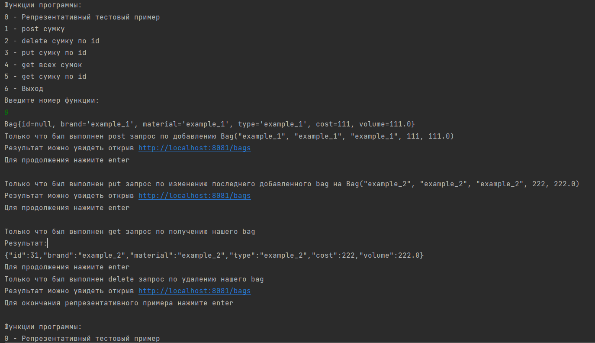

# Практическая работа 7: Архитектура REST
Никита Самарин
КИ21-17/1Б
Вариант: 17. Сумка

Работа выполнена на основе работы №5

## Инструкции по сборке и запуску проекта
Запустить программу можно с помощью комманды:
    ```
    psql -f ./bag.sql
    java -jar pr7_rest\target\pr7_rest-1.jar
    java -jar pr7_client\target\pr7_client-1.jar
    ```
Таким образом образом будет запущены web приложение и консольный rest клиент

web приложение доступно по ссылке http://localhost:8081/bags, функции предыдущей работы(№5) сохранены

В консольном rest клиенте вы можете выполнить get/post/delete/put запросы или выполнить **Репрезентативный тестовый пример**




Собрать программу с нуля можно с помощью выполнения следующих комманд последовательно в папках pr7_rest И pr7_client:
    ```
    mvn clean
    mvn compile
    mvn package
    mvn install
    ```