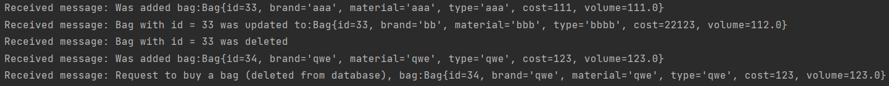

# Практическая работа 8: Spring JMS
Никита Самарин
КИ21-17/1Б
Вариант: 17. Сумка

Работа выполнена на основе работы №5
Из дополнительных, не обязательных, задач реализована только кнопка покупки, удаляющая объект из базы и создающая специальное сообщение

## Инструкции по сборке и запуску проекта
Собрать программу с нуля можно с помощью выполнения следующих комманд последовательно в папках pr8 И pr8_message_client:
    ```
    mvn clean
    mvn compile
    mvn package
    mvn install
    ```
Также необходимо выполнить в корневой папке комманду:
    ```
    psql -f ./bag.sql
    ```

Далее можно запустить web приложение с помощью комманды:
    ```
    java -jar pr8\target\pr8-1.jar
    ```
web приложение доступно по ссылке http://localhost:8081/bags, функции предыдущей работы(№5) сохранены
Выполнив какие-либо операции и после этого **ОТКЛЮЧИВ** web приложение, можно запустить клиент-брокер сообщений JMS:
    ```
    java -jar pr8_message_client\target\pr8_message_client-1.jar
    ```
В нём будут отображены все полученые сообщения из очереди
Сообщения приходят по поводу добавления/изменения/удаления/покупки объекта



